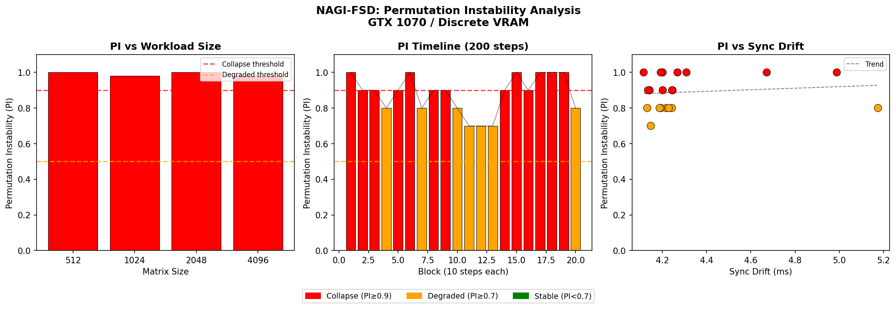
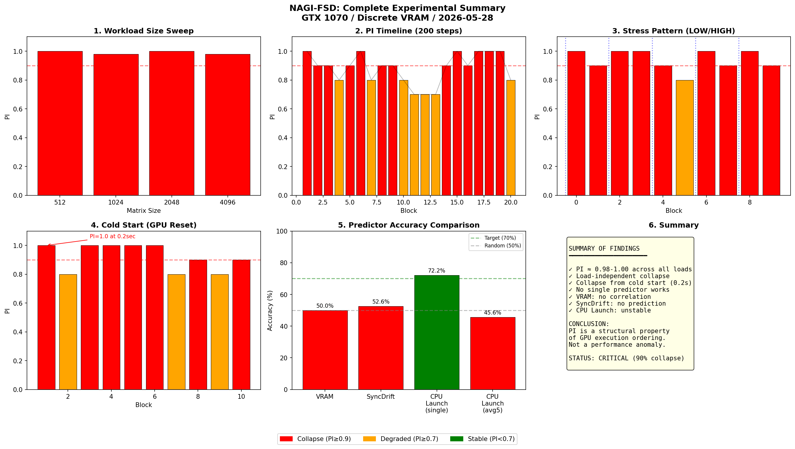

# NAGI-FSD
GPU Execution Order Collapse Detection - Failure Signature Detector
# NAGI-FSD: GPU Execution Order Collapse Detector

## What is this?

A measurement framework for detecting **Permutation Instability (PI)** in GPU execution timing — a structural phenomenon that conventional monitoring tools (Datadog, Prometheus) cannot observe.

## Key Finding

GPU execution step times appear normal by conventional metrics (latency, throughput, VRAM), yet their **ordering structure collapses** consistently.

This is not a performance degradation. It is a structural property of GPU execution ordering.

## Permutation Instability (PI)

PI measures how much the rank ordering of execution times deviates from stability:

- `PI = 0.0` → Stable ordering
- `PI = 0.5` → Degraded ordering  
- `PI = 0.9+` → Collapse of exe

## Analysis Results

## FSD Realtime Monitor

`fsd_realtime.py` implements a realtime collapse monitor:

- Tracks PI per block in real time
- Detects sustained collapse (3+ consecutive high-PI blocks)
- Outputs NORMAL / DEGRADED / COLLAPSE / SUSTAINED COLLAPSE

### Sample Output (GTX 1070)
- Mean PI: 0.937
- Collapse rate: 90.0%
- Sustained collapse alerts: 19/30 blocks
- Final status: CRITICAL
## Analysis Results

### Complete Experimental Summary

### Detailed Analysis

